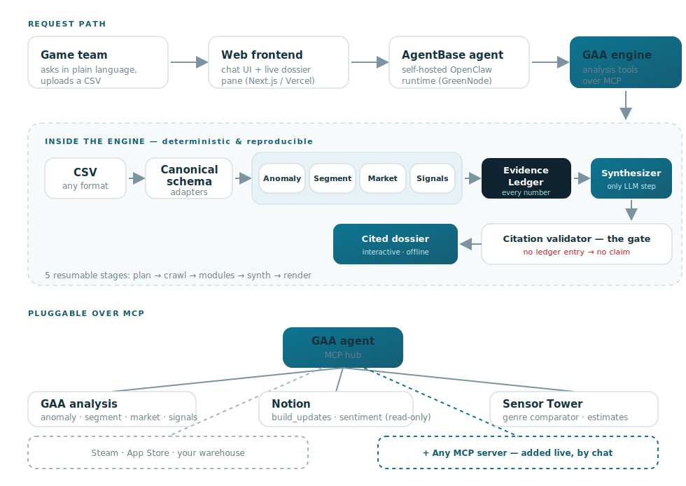

# Game Attribution Agent (GAA) powered by Rocket (RES)

> Claw-a-thon · Data Analysis track
> *"Revenue dropped. Is it you, or the market?" — GAA answers, with receipts.*

---

## The story we tell

A game producer doesn't open GAA in a panic. Every Monday before standup, the agent
has already run on last week's numbers and posts a line nobody asked for:

> "SEA retention has been sliding for 3 days. Historically retention leads revenue by
> ~1 day (corr +0.93). Revenue hasn't moved yet, but it likely will next week if this holds."

The producer asks back, right in the chat — no ticket, no data team:

> "Why is SEA dropping? Is it the build we just shipped?"

In ~90 seconds the agent doesn't just hand over a number — it **tells the story behind
the number**, against explicit criteria, on data that is cleanly split **internal vs
external**, and it **sketches the plausible scenarios and rules them out**:

- **Market scenario** — the fishing genre is cooling → checked against a same-genre
  benchmark: *not happening*. Rejected.
- **Internal scenario** — the new build touched spawn rates for exactly the SEA cohort →
  matches the Notion build log and Discord sentiment. *This is it.*

Every claim is clickable to its evidence and source, with a self-rated confidence.
The team sees the whole picture on one screen, eliminates the wrong scenario, and decides
on the spot: roll back the spawn change for SEA only, ship a retention event **this week**
— before revenue ever breaks. The −25% incident never happens.

**The point:** GAA tells the *story behind the data* — on transparent criteria, on
visual internal/external evidence, and **reliably** (every number cited, nothing invented)
— it draws the feasible scenarios, so a decision-maker sees the full picture instead of a
lone metric, and decides **fast, cleanly, and with trust**.

---

## How we serve that story — Architecture & Approach

The agent is one self-hosted runtime on **GreenNode AgentBase** that wraps a
**deterministic analytics engine**. A plain-language question travels browser → frontend →
agent → engine; inside the engine a reproducible, offline pipeline plays out; and every
data source plugs in as an MCP server.

### The engine pipeline (5 resumable stages)

| Stage | What it does |
|---|---|
| **1. Plan** | Read the question, scan metrics, pinpoint *when* the movement broke (change-point). |
| **2. Crawl** | Load the genre benchmark — the same-genre (Sensor Tower) comparator. |
| **3. Modules** | Run segment · market · signals, plus autonomous exploration for unprompted findings. |
| **4. Synth** | The **only** LLM step — writes the hypothesis, sampled 3× for self-consistency. |
| **5. Render** | Validate **every** citation, then build the interactive dossier. |

Each call advances as far as its time budget allows, then suspends and resumes — so a long
analysis never blocks the chat.

### The trust contract — why the numbers are reliable

This is the core of the approach:

- **The math is deterministic.** The engine computes every number in-process, no LLM in
  the loop — same input, same output.
- **The LLM only writes.** It routes the question, maps CSV columns to the schema, and
  writes the human-readable narrative. It never invents a finding.
- **Evidence Ledger + Citation validator.** Every finding lands in the ledger with its
  source and strength. **No ledger entry → no claim.** That is why GAA cannot hallucinate
  a number.
- **It rates its own confidence** (likelihood × evidence, e.g. *Likely × Strong*) and
  states what it is *not* sure about under "assumptions / gaps."

### The four methods (internal vs external)

| Method | Technique | Answers |
|---|---|---|
| **Anomaly** | change-point + STL | how big the move is, and exactly when it broke |
| **Segment** | Adtributor | which cohort drove it, as a citable % (SEA = 82%) |
| **Market** | CausalImpact counterfactual | what *would* have happened at market rates — the gap is on you |
| **Signals** | web + Notion | the "why": builds, player sentiment, competitor events |

Together they answer one question — *is it you, or the market?* — as a split, every number cited.

### Extensibility — it speaks MCP

Every data source is a pluggable **MCP server**: GAA's own analysis tools, Notion
(read-only build log + player sentiment), Sensor Tower (genre comparator). Anything that
speaks MCP — Steam, App Store, your warehouse — plugs in **live, by chat, with no
redeploy**; non-admins stay locked to a safe allowlist.

---

## Demo

See [`DEMO_SCRIPT.md`](DEMO_SCRIPT.md) (3-min walkthrough) and [`RUNBOOK.md`](RUNBOOK.md)
(how to record / what is real vs staged). Behind-the-scenes explainer slides: open
[`index.html`](index.html).
