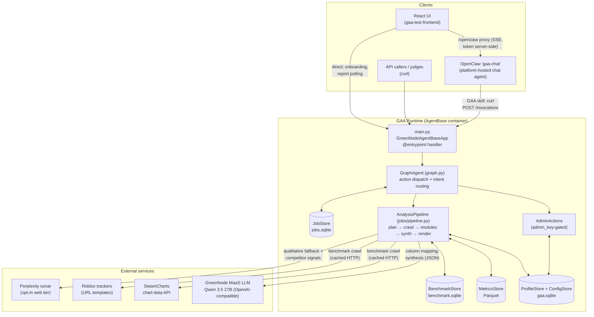
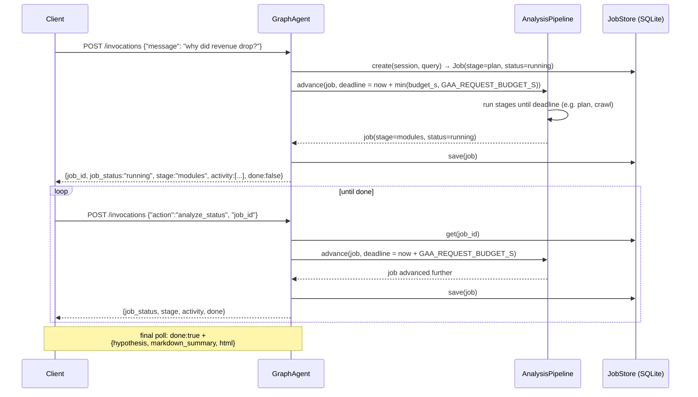
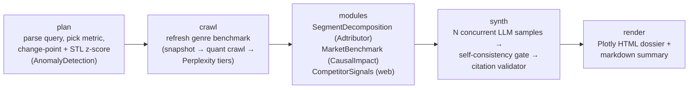
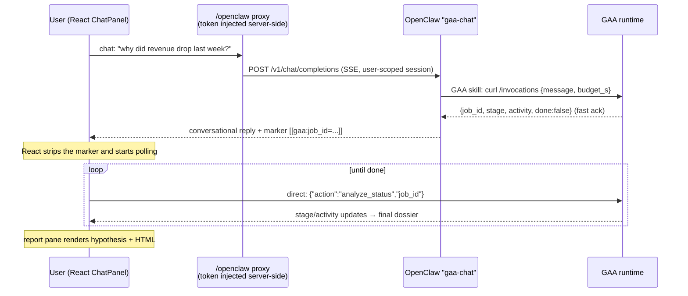

# Game Attribution Agent — Technical Design Document

**Status:** As-built (describes the implemented system)
**Date:** 2026-06-12
**Deployment:** GreenNode AgentBase, Claw-a-thon 2026 (Data Analysis track)
**Related docs:** original design spec ([2026-06-10](superpowers/specs/2026-06-10-game-attribution-agent-design.md)), OpenClaw integration spec ([2026-06-12](superpowers/specs/2026-06-12-openclaw-chat-integration-design.md)), implementation plans in [docs/superpowers/plans/](superpowers/plans/)

---

## 1. Executive Summary

The Game Attribution Agent (GAA) is an AI analyst that answers the question every game operator asks when a metric moves: **"is it us, or is it the market?"**

Given a game's daily metrics (CSV or Roblox dashboard export) and a free-text question like *"why did my revenue drop last week?"* — or even just *"what's going on with my game?"* — the agent:

1. **Finds the movement** — detects the most statistically salient metric change and pinpoints *when* it broke (change-point detection) and *how anomalous* it is (seasonal-adjusted z-score).
2. **Decomposes it internally** — identifies which segment (version, region, cohort, device, source) drove the change, with a citable percentage contribution (Adtributor algorithm).
3. **Cross-checks the market** — builds a counterfactual forecast from a genre benchmark (CausalImpact-style Bayesian structural time series) to separate internal causes from market-wide trends, and crawls live Steam/Roblox/web data for competitor and event signals.
4. **Writes the story** — an LLM synthesizes a structured *Attribution Hypothesis* from the collected evidence, where **every claim must cite an evidence ledger entry** and confidence is reported on two independent axes: *likelihood* and *evidence quality*.
5. **Renders the report** — a self-contained interactive HTML dossier (time series with break shading, internal-vs-market overlay chart, confidence matrix) plus a chat-friendly markdown summary.

Three design commitments distinguish the system:

- **The LLM never invents findings.** All numbers come from deterministic, research-backed analytics running in-process. The LLM only routes intent, maps columns during onboarding, and writes the narrative — and a citation validator drops any claim that doesn't reference ledger evidence.
- **Honest uncertainty.** A self-consistency gate samples the synthesis N times; if the samples disagree on the primary cause direction, the headline evidence quality is downgraded and the disagreement is disclosed. The agent presents *scenarios, not decisions*.
- **Built for the platform's constraints.** Analysis runs as a resumable async job that suspends before the AgentBase request timeout and resumes on poll — no work is lost, and synchronous callers (like a chat agent) get a fast acknowledgment.

The system is deployed as a Docker container on GreenNode AgentBase, fronted by a platform-hosted OpenClaw chat agent so end users can both *use* and *administer* the analyst by chatting.

---

## 2. Goals, Non-Goals, and Constraints

### Goals

- Attribute a game-metric movement to internal vs. market causes with cited, quantified evidence.
- Zero-code onboarding: connect a game's data via chat; an LLM proposes the column mapping for human confirmation.
- Survive the platform's hard request timeout without losing analysis progress.
- Be reconfigurable at runtime (data sources, behavior) without redeploys — including by chat.
- Degrade gracefully: every external dependency has a fallback tier; the agent never 500s a request.

### Non-Goals

- Prescriptive recommendations ("do X") — the agent outputs scenarios and signals-to-watch; the call is the operator's.
- Hard multi-tenant isolation — profiles are shared per deployment; sessions scope jobs, not data.
- Real-time/streaming ingestion — data arrives as batch exports.

### Constraints that shaped the design

| Constraint | Design consequence |
|---|---|
| AgentBase closes requests at ~50 s | Resumable 5-stage job pipeline with a per-request time budget (`GAA_REQUEST_BUDGET_S`, default 40 s); clients poll to completion |
| Single container, no managed queue/DB | SQLite for jobs/profiles/config, Parquet for metrics, disk cache for HTTP — all inside the container volume |
| MaaS LLM (Qwen 3.5 27B) is a thinking model | Thinking disabled via `chat_template_kwargs` for fast, direct JSON output |
| External web search costs money | Perplexity tier is opt-in (key unset → never called) and only fires when quantitative crawl is insufficient |
| Hackathon judges will poke at it | Handler wraps everything in graceful-degradation `try/except`; help intent answers greetings without burning an analysis job |

---

## 3. System Architecture



**Module layout** (`src/gaa/`):

| Package | Responsibility |
|---|---|
| `adapters/` | Normalize raw exports (CSV, Roblox) into the canonical metrics schema |
| `analytics/` | Pure statistical methods: `changepoint.py`, `adtributor.py`, `causal.py` |
| `modules/` | Analysis modules implementing the `AnalysisModule` protocol; each reads an `AnalysisContext` and writes `LedgerEntry`s |
| `orchestrator/` | `router.py` (intent classification), `planner.py` (metric/direction extraction from the query) |
| `jobs/` | `Job` model, SQLite `JobStore`, resumable `AnalysisPipeline` |
| `synth/` | LLM synthesis, concurrent self-consistency sampling, abstention gate, citation validator |
| `schema/` | Pydantic models: canonical metrics, `GameProfile`/`ColumnMapping`, `EvidenceLedger`, `AttributionHypothesis`, dual-axis `Confidence` |
| `sources/` | Benchmark/signal source protocols, providers (Steam, Roblox, web), config-driven `DynamicRefresher`/`DynamicSignals` facades |
| `crawl/` | `CachedFetcher` (httpx + disk cache), Perplexity client, `BenchmarkRefresher` |
| `store/` | SQLite/Parquet persistence: profiles, metrics, benchmark series, runtime config |
| `render/` | Jinja2 + Plotly HTML report, markdown summary, chart builders |
| `llm/` | `LangChainMaaSLLM` (OpenAI-compatible via langchain-openai) and `FakeLLM` for tests |
| `onboarding/` | LLM-assisted column-mapping `Profiler` |
| `graph.py` | `GraphAgent` — the single handler behind the entrypoint |
| `admin_actions.py` | Runtime config/profile CRUD, constant-time admin-key check |

The composition root is `main.py`: it constructs every store, source, and client **once** and wires them into a shared `AnalysisPipeline` and `GraphAgent`. The pipeline and agent share the same `ProfileStore`/`MetricsStore` instances, so an onboarding confirmed in one request is immediately analyzable in the next.

---

## 4. API Contract and Request Lifecycle

The runtime exposes the standard AgentBase surface: `POST /invocations` (all actions) and `GET /health` (ping → `HEALTHY`). Session and user identity arrive via the optional headers `X-GreenNode-AgentBase-Session-Id` / `X-GreenNode-AgentBase-User-Id`, defaulted to `default`/`anon` so header-less callers (e.g. OpenClaw's curl) still work.

### 4.1 Action catalog

| Payload | Purpose | Returns |
|---|---|---|
| `{"message": "...", "budget_s"?: float}` | Free-text entry. Routed by intent to **setup** guidance, a **help** reply, or an **analyze** job | mode-specific (see below) |
| `{"action": "onboard_propose", "adapter": "csv"\|"roblox", "csv_data"\|"csv_path": ...}` | LLM proposes a column mapping from the first 20 rows | `{mode:"setup", mapping, message}` |
| `{"action": "onboard_confirm", name, platform, genre, adapter, mapping, csv_data\|csv_path}` | Ingest the file through the adapter, persist profile + metrics, activate the profile | `{mode:"setup", name, row_count, metrics[]}` |
| `{"action": "analyze_status", "job_id": "..."}` | Resume/poll an analysis job | job response (below) |
| `{"action": "admin_get_config" \| "admin_set_config" \| "admin_set_behavior" \| "list_profiles" \| "set_active_profile", "admin_key": "..."}` | Runtime administration (§10) | action-specific |

Every response carries `"status": "success"` or `"status": "error", "error": "..."` — the entrypoint catches all exceptions so a malformed request degrades to a structured error rather than an HTTP 500.

### 4.2 Intent routing (free-text path)

`classify_intent(message, has_active_profile)` in `orchestrator/router.py` is deliberately **not** an LLM call — it is deterministic substring/token matching, which makes routing instant, free, and testable:

1. Setup hints (`"connect"`, `"onboard"`, `"csv"`, `"upload"`, …) → **setup**.
2. No active profile yet → **setup** (nothing to analyze; guide to onboarding).
3. Greeting or capability question (`"what can you do"`, leading `"hi"` on a short message, bare `"help"`/`"?"`) → **help** (canned capability reply; avoids burning a full analysis job on small talk).
4. Otherwise → **analyze**.

### 4.3 Async job lifecycle (job + poll)

Analysis cannot reliably finish inside one AgentBase request, so it runs as a **resumable job**:



Key properties:

- **Job model** (`jobs/models.py`): `job_id`, `session`, `query`, `stage`, `status ∈ {running, done, error}`, a free-form `state` dict (intermediate results), an append-only `activity` log (`{ts, stage, text}` — the "thinking trace" surfaced in chat UIs), and a `result` dict when done.
- **Per-request budget.** Each call gets `deadline = monotonic() + GAA_REQUEST_BUDGET_S` (default 40 s, safely under the platform's ~50 s close). The first call additionally honors a caller-supplied `budget_s` (clamped to `[0, GAA_REQUEST_BUDGET_S]`) so synchronous intermediaries — OpenClaw's `exec` tool in particular — can get a job-id acknowledgment in a couple of seconds and leave the heavy stages to the poller.
- **At-least-one-stage guarantee.** The deadline is checked *before each stage except the first*, so even an already-expired deadline advances exactly one stage per call. This makes progress monotonic (a poll can never be a no-op) and resume tests deterministic.
- **Persistence at the boundary.** The pipeline mutates the job in memory; `GraphAgent` saves it to the `JobStore` after every `advance`. A crashed or recycled container resumes any job from its last persisted stage.

---

## 5. The Analysis Pipeline

`AnalysisPipeline` (`jobs/pipeline.py`) runs five stages in fixed order. Each stage reads/writes `job.state`, appends one activity line, and sets `job.stage` to the next stage — making every stage boundary a valid suspend point.



**Stage `plan`.** Loads the active profile and its metrics. `parse_query` extracts the target metric (alias table: "rev"/"earnings" → `revenue`, etc.) and direction ("drop/fell" → down). If no metric was named, `AnomalyDetection` picks the most *statistically* salient one (z-score-based salience, not raw % change, so a noisy metric doesn't always win). It then runs change-point detection and seasonal-adjusted deviation scoring (§6), writes the first ledger entries, and stores `{metric, start, end, direction, changepoint, genre, platform, profile_name, ledger}` into `job.state`.

**Stage `crawl`.** Asks `DynamicRefresher` to refresh the genre benchmark for the analysis window (the three-tier strategy in §8.2). The result lands in the `BenchmarkStore`; the activity line reports which tier supplied data and how many points.

**Stage `modules`.** Rebuilds the `AnalysisContext` from `job.state` — crucially, the profile is reloaded **by the name persisted at plan time, not `get_active()`**, so an admin switching the active profile mid-job cannot cross-contaminate an in-flight analysis. Then three modules append to the evidence ledger:

- `SegmentDecomposition` — Adtributor over the profile's dimensions.
- `MarketBenchmark` — CausalImpact-style counterfactual vs. the genre trend.
- `CompetitorSignals` — crawled news/update/social signals in the window.

**Stage `synth`.** Samples the synthesizer `GAA_N_SAMPLES` times concurrently (ThreadPoolExecutor), applies the self-consistency gate, then the citation validator (§7). The surviving `AttributionHypothesis` goes into `job.state`.

**Stage `render`.** Builds the metric series and genre trend, renders the self-contained HTML report and the markdown summary, sets `job.result = {hypothesis, markdown_summary, html}` and `status = "done"`.

**Error semantics.** Any stage exception flips the job to `status="error"` with the message preserved — the job is never left silently stuck, and the poller surfaces the error to the client.

> **Design history:** the original plan orchestrated this with a LangGraph `StateGraph`. It was replaced by this hand-rolled pipeline because LangGraph's checkpoint model didn't map cleanly onto AgentBase's per-request budget + hard close — the pipeline needed *deadline-aware suspension between deterministic stages*, which is simpler to guarantee with an explicit stage list. The `GraphAgent` name and the `langgraph` dependency remain for compatibility.

---

## 6. Analytics Methods (the deterministic core)

All quantitative findings come from three research-backed methods implemented in `src/gaa/analytics/` — chosen and verified against literature in the [analytics-rigor plan](superpowers/plans/2026-06-11-game-attribution-agent-plan-2a-analytics-rigor.md).

### 6.1 Change-point detection — *when did it break?*

`changepoint.py` uses **ruptures (PELT)** constrained to a single breakpoint to date the structural break in the metric series. For series with ≥14 points, an **STL decomposition** first removes weekly seasonality so a normal weekend dip isn't flagged as a break; the anomaly magnitude is reported as a z-score on the deseasonalized residual (`deviation_z`), falling back to a simple z-score for short series.

### 6.2 Adtributor — *which segment drove it?*

`adtributor.py` is an in-house implementation of Microsoft's **Adtributor** root-cause algorithm (NSDI '14). For each dimension (region, version, cohort, device, source) it scores segment elements by *explanatory power* (share of the total metric delta) and *surprise* (Jensen–Shannon divergence between expected and actual distributions), selecting elements until cumulative explanatory power passes the TEEP threshold (67%). Each selected segment becomes a ledger entry with its citable % contribution.

### 6.3 CausalImpact-style counterfactual — *us or the market?*

`causal.py` fits a **Bayesian structural time-series** (statsmodels `UnobservedComponents`) on the *pre-break* period with the genre benchmark as control, forecasts the counterfactual over the *post-break* period, and reports the cumulative effect (actual − counterfactual) with a 95% CI. The verdict — internal-driven, market-wide, or partly internal — depends on whether the CI excludes zero. If the pre-period is too short (<5 points) or the post-period too sparse, it falls back to an indexed %-change comparison and says so in the ledger entry (weaker evidence, honestly labeled).

### 6.4 Self-consistency gate — *should we hedge?*

`synth/gate.py` implements a lightweight abstention mechanism: the synthesis is sampled N times (default 3, concurrently); the *consistency score* is the modal share of the primary cause direction (internal / market / none) across samples. If agreement < 0.67, the headline `evidence_quality` is downgraded one notch (Strong→Moderate→Weak) and an explicit gap note is appended: *"Model self-consistency low (NN% agreement across N samples)…"*. Disagreement between samples is treated as a measurable signal of an under-determined answer.

---

## 7. Evidence Ledger, Synthesis, and the Trust Chain

The architectural spine is a strict separation between **finding facts** and **telling the story**:

```
deterministic modules ──write──► EvidenceLedger ──read──► LLM synthesizer ──checked by──► citation validator
```

- **EvidenceLedger** (`schema/ledger.py`) — the single source of truth. Every module appends `LedgerEntry`s: a claim, its quantitative value, a strength rating, and provenance. The ledger is serialized into `job.state` between stages and attached verbatim to the final hypothesis, so a reader can audit every citation.
- **Synthesizer** (`synth/synthesizer.py`) — prompts the MaaS LLM with the ledger and the user's question, requesting JSON conforming to the `AttributionHypothesis` schema. Operator `behavior_instructions` (§10) are appended as clearly-delimited preferences (e.g. output language) — they can shape tone, never evidence rules.
- **Citation validator** (`synth/validator.py`) — post-hoc enforcement: every `Cause` must carry `evidence_ids` that exist in the ledger; uncited claims are dropped. This is the hard guarantee behind "the LLM never invents findings."

### The Attribution Hypothesis (output schema)

```python
AttributionHypothesis:
    main_story: str                      # one-paragraph narrative
    confidence: Confidence               # dual-axis: likelihood × evidence_quality
    causes:
        internal: [Cause]                # claim, evidence_ids[], likelihood, evidence_quality
        market:   [Cause]
    scenarios: [Scenario]                # description, confidence, signals_to_watch[]
    risks: [Risk]
    evidence: [LedgerEntry]              # the full audited ledger
    assumptions_and_gaps: [str]          # honest limitations, incl. gate downgrades
    rationale: str
```

**Dual-axis confidence** is deliberate: *likelihood* (Very likely / Likely / Possible / Unlikely) expresses how probable a cause is, while *evidence quality* (Strong / Moderate / Weak) expresses how good the supporting data is. "Likely but weakly evidenced" and "possible but strongly evidenced" are different epistemic states an operator should distinguish — collapsing them into one score is how dashboards lie.

---

## 8. Data Layer

### 8.1 Internal data: adapters → canonical schema → Parquet

Onboarding is a two-step, human-in-the-loop flow:

1. **`onboard_propose`** — the `Profiler` shows the LLM the first 20 rows (only — proposal latency is independent of file size) and gets back a `ColumnMapping` proposal, returned with a confirmation message.
2. **`onboard_confirm`** — the chosen adapter (`CSVAdapter` or `RobloxAdapter`) applies the confirmed mapping and normalizes everything into the **canonical schema**: long-format rows of `{date, metric, value, dimension_*}` validated by `validate_canonical`. Metrics persist to Parquet via `MetricsStore`; the `GameProfile` (name, platform, genre, mapping) persists to SQLite and becomes the active profile.

Files arrive either as inline `csv_data` (browser upload) or a server-side `csv_path`. The canonical schema means every downstream module is platform-agnostic — adding a new platform is one adapter.

### 8.2 External data: the three-tier benchmark strategy

Market benchmark data answers "what did the genre do over this window?" and is fetched by `DynamicRefresher` in escalating tiers:

| Tier | Trigger | Source | Output |
|---|---|---|---|
| 1. **Snapshot floor** | always on | bundled `data/seed/benchmark_snapshot.json`, seeded into `BenchmarkStore` on every cold start (rebuildable via `scripts/build_benchmark_snapshot.py`) | genre trend series — guarantees the counterfactual never runs empty |
| 2. **Quant crawl** | `benchmark_mode = "crawl"` | `SteamBenchmarkProvider` (real SteamCharts `chart-data.json` API, curated genre→app-id map) and `RobloxBenchmarkProvider` (configurable URL templates) | live daily player/CCU series for comparator games |
| 3. **Web tier** | crawl insufficient *and* `perplexity_api_key` set | Perplexity `sonar` | qualitative trend direction + summary **with citations** (feeds the ledger as qualitative evidence) |

All HTTP goes through `CachedFetcher` → `DiskCache`: cache-first with live fallback, so a demo replays deterministically offline once warmed, and flaky trackers can't fail a job. Competitor/event signals (`CompetitorSignals` module) use the same pattern via `DynamicSignals` → `WebSignalsSource`.

### 8.3 Persistence map

| Store | Backing | Contents |
|---|---|---|
| `ProfileStore` | `gaa.sqlite` | game profiles + active-profile flag |
| `ConfigStore` | `gaa.sqlite` (`config` table) | runtime config overrides (§10) |
| `MetricsStore` | Parquet under `GAA_CACHE_DIR/metrics` | canonical metrics per game |
| `BenchmarkStore` | `benchmark.sqlite` | genre trend series (snapshot + crawled) |
| `JobStore` | `jobs.sqlite` | jobs: `(job_id, session, status, json, updated_at)`, with TTL `cleanup()` |
| `DiskCache` | files under `GAA_CACHE_DIR` | raw HTTP responses |

---

## 9. LLM Usage

The LLM surface is intentionally small — three call sites, all structured-output:

| Call site | Model | Purpose |
|---|---|---|
| `onboarding/profiler.py` | MaaS Qwen 3.5 27B | propose a `ColumnMapping` from sample rows |
| `synth/synthesizer.py` | MaaS Qwen 3.5 27B (× N samples) | ledger + question → `AttributionHypothesis` JSON |
| `crawl/perplexity.py` | Perplexity `sonar` (opt-in) | qualitative market trend + competitor signals, with citations |

Notably **not** LLM-driven: intent routing, metric selection, all statistics, citation checking, rendering.

`LangChainMaaSLLM` (`llm/client.py`) wraps the OpenAI-compatible GreenNode MaaS endpoint (`LLM_BASE_URL`, default `https://maas-llm-aiplatform-hcm.api.vngcloud.vn/v1`) via `langchain-openai`. Qwen 3.5 is a thinking model; calls pass `extra_body={"chat_template_kwargs": {"enable_thinking": False}}` to skip reasoning tokens and return JSON directly. Responses are parsed by a tolerant `_extract_json` and validated against Pydantic schemas. A `FakeLLM` with preset responses backs the entire test suite, so end-to-end pipeline tests run deterministic and offline.

Perplexity is external to the platform and therefore: disabled unless `PERPLEXITY_API_KEY` is set, only consulted when the quant tiers are insufficient, and declared in the README per hackathon rules. Its citations are carried into the ledger (including tolerating both string- and object-shaped citation payloads — a live-incident fix).

---

## 10. Runtime Configuration and Admin API

The system is reconfigurable while running — the foundation of the "administer by chat" demo.

**`ConfigStore`** (`store/config_store.py`) holds typed keys with per-key resolution order **stored value → environment variable → built-in default**, and validation on write (enum check for `benchmark_mode`, `http(s)://` shape for URL templates, secrets masked to last 4 chars on read):

| Key | Env fallback | Meaning |
|---|---|---|
| `benchmark_mode` | `GAA_BENCHMARK_MODE` | `snapshot` (default) or `crawl` (live trackers) |
| `roblox_discover_url_tmpl` / `roblox_series_url_tmpl` | `GAA_ROBLOX_*_URL_TMPL` | Roblox tracker endpoints |
| `steam_series_url_tmpl` | `GAA_STEAM_SERIES_URL_TMPL` | SteamCharts endpoint |
| `perplexity_api_key` | `PERPLEXITY_API_KEY` | web tier on/off switch (secret) |
| `signals_url_tmpl` | `GAA_SIGNALS_URL_TMPL` | competitor-signals endpoint |
| `behavior_instructions` | `GAA_BEHAVIOR_INSTRUCTIONS` | free text appended to the synthesis prompt (≤2,000 chars) |

Because `DynamicRefresher`/`DynamicSignals` resolve config **per job** (not frozen at startup) and the synthesizer pulls `behavior_instructions` through a provider lambda at call time, an admin change takes effect on the very next analysis — no restart.

**Admin actions** ride the existing `/invocations` entrypoint, guarded by a payload field `admin_key` compared in constant time against env `GAA_ADMIN_KEY` (payload-based because the AgentBase SDK doesn't guarantee arbitrary header passthrough; admin actions are disabled entirely if the key is unset):

| Action | Effect |
|---|---|
| `admin_get_config` | all keys with `{value, origin}` (origin ∈ store/env/default), secrets masked |
| `admin_set_config` | set/clear keys with validation; returns the new resolved config |
| `admin_set_behavior` | set `behavior_instructions` |
| `list_profiles` / `set_active_profile` | game profile management |

---

## 11. OpenClaw Chat Integration

A platform-hosted **OpenClaw** instance (`gaa-chat`) sits between the React frontend and the GAA runtime, turning the structured API into a conversation — for end users *and* for the admin. (Full spec: [2026-06-12 design](superpowers/specs/2026-06-12-openclaw-chat-integration-design.md).)



Routing inside OpenClaw is **instruction-driven, not code**: its workspace carries a GAA skill (`skills/gaa/SKILL.md` — action catalog, curl recipes, the `[[gaa:job_id=...]]` marker convention) and `AGENTS.md` red-lines (admin actions only for sessions whose user id starts with `admin:`). Three conversation classes emerge:

- **Analysis question** → call GAA, reply conversationally, embed the job-id marker; React polls GAA directly for the heavy payload (the dossier never travels through the chat model).
- **Admin instruction** ("switch benchmarks to live crawl", "answer in Vietnamese from now on") → call a GAA admin action and/or edit its own workspace files, then confirm what changed.
- **Small talk** → answered from OpenClaw's own LLM and per-user session memory.

**`scripts/openclaw_bootstrap.py`** provisions all of this idempotently over the gateway WebSocket (enable the `chatCompletions` HTTP endpoint via `config.get`→splice→`config.set` hot-reload, install the skill, write endpoint/key into the workspace `.env`, seed `AGENTS.md`, then probe-verify). It doubles as the integration smoke test and is the recovery path if the workspace drifts.

Heavy/structured paths intentionally bypass chat: CSV onboarding and report polling stay direct React → GAA.

**Security posture (accepted for the demo, documented):** the gateway token grants full operator access, so it lives only server-side in the proxy (`.env.local`, git-ignored). Role separation between user and admin chat is *soft* (instructions + the server-side `admin_key` check at GAA); the hardening path is a second, admin-only OpenClaw instance holding the key.

---

## 12. Rendering and Output

`render/report.py` produces a **self-contained HTML dossier** (Jinja2 template + inline Plotly, no network dependencies after generation) with three signature visuals:

1. **Time series** of the affected metric with the detected break window shaded.
2. **Internal-vs-market overlay** — the game's metric and the genre benchmark indexed to 100, making "us vs. the market" visible at a glance.
3. **Confidence matrix** — causes and scenarios plotted on the likelihood × evidence-quality grid.

plus the narrative, cause lists (with citation references), scenarios with signals-to-watch, and the assumptions-and-gaps section. `render/markdown.py` emits the parallel chat-friendly summary. Both are returned in `job.result`, so any client — chat, report pane, or curl — picks the format it needs.

---

## 13. Reliability and Error Handling

Defense in depth, from the outside in:

- **Entrypoint:** catch-all `try/except` returns `{"status":"error", ...}` — the runtime never 500s.
- **Pipeline:** stage exceptions mark the job `error` with the message preserved; pollers see it immediately.
- **Job resumability:** every stage boundary is persisted; container restarts lose at most the in-flight stage.
- **Benchmark tiers:** snapshot floor guarantees the counterfactual always has a control series; crawl and web tiers are additive, never load-bearing.
- **HTTP caching:** cache-first fetching makes warmed demos deterministic and immune to tracker flakiness.
- **Analytics fallbacks:** short series → simple z-score instead of STL; thin pre-period → indexed comparison instead of BSTS — each fallback labels its evidence as weaker rather than failing.
- **Synthesis:** if concurrent sampling yields nothing, a single synchronous sample is attempted; low agreement downgrades confidence rather than blocking output.
- **Profile pinning:** in-flight jobs reload the profile by persisted name, immune to concurrent admin profile switches.

---

## 14. Testing

**216 tests** (pytest), TDD throughout, all deterministic and offline:

- **Unit coverage mirrors `src/`** — every package has a matching `tests/` directory: analytics methods against known series, adapters against fixture exports, stores against temp databases, router/planner against phrase tables.
- **`FakeLLM`** with preset JSON responses stands in for MaaS, so synthesis, gating, and citation-validation logic are tested without a network or nondeterminism.
- **Pipeline resumability** is tested with `deadline = time.monotonic()` (already expired), exploiting the at-least-one-stage guarantee to step the pipeline exactly one stage per call and assert suspend/resume behavior.
- **End-to-end** (`test_engine_full.py`, `test_graph*.py`): full plan→render runs with real analytics on fixture data, plus `GraphAgent` integration across onboarding, help, analyze, and admin paths.
- **Live verification** happens outside pytest: deploy smoke tests via the AgentBase endpoint, the OpenClaw bootstrap probe, and the scripted demo runbook (`docs/demo-script.md`).

---

## 15. Deployment

| Item | Value |
|---|---|
| Runtime | `gaa` (`runtime-2951893e-…`) on GreenNode AgentBase, PUBLIC, 1 replica |
| Flavor | `runtime-s2-general-2x4` (2 vCPU / 4 GB) |
| Image | `vcr.vngcloud.vn/111480-abp111723/gaa` (managed Container Registry), built `linux/amd64` |
| Endpoint | `https://endpoint-f6f69523-948a-4763-af77-05359b001b16.agentbase-runtime.aiplatform.vngcloud.vn` |
| Base image | `python:3.11-slim`; serves on `:8080` via the AgentBase SDK app |
| Credentials | `GREENNODE_*` auto-injected by the runtime (never baked into image or env file) |

### Environment variables

| Variable | Default | Purpose |
|---|---|---|
| `LLM_BASE_URL` | GreenNode MaaS HCM endpoint | OpenAI-compatible LLM API |
| `LLM_API_KEY`, `LLM_MODEL` | — | MaaS credentials; model `qwen/qwen3-5-27b` |
| `GAA_REQUEST_BUDGET_S` | `40` | per-request pipeline budget (s) |
| `GAA_N_SAMPLES` | `3` | self-consistency sample count |
| `GAA_DB_PATH` | `gaa.sqlite` | profiles + config DB |
| `GAA_CACHE_DIR` | `data/cache` | metrics Parquet, benchmark DB, jobs DB, HTTP cache |
| `GAA_ADMIN_KEY` | unset | enables + guards admin actions |
| `GAA_BENCHMARK_MODE` | `snapshot` | benchmark tier switch (overridable at runtime via ConfigStore) |
| `GAA_ROBLOX_*_URL_TMPL`, `GAA_STEAM_SERIES_URL_TMPL`, `GAA_SIGNALS_URL_TMPL` | — | crawl endpoints |
| `PERPLEXITY_API_KEY` (+ `_BASE_URL`, `_MODEL`) | unset / `sonar` | opt-in web tier |
| `GAA_BEHAVIOR_INSTRUCTIONS` | — | initial synthesis-prompt addendum |
| `MEMORY_ID` | — | optional AgentBase conversation memory |

Key runtime dependencies: `greennode-agentbase` (+ `greennode-agent-bridge[langgraph]`), `langchain-openai`, `pandas`/`pyarrow`/`duckdb`, `statsmodels` (BSTS, STL), `ruptures` (change-point), `plotly` + `jinja2` (report), `httpx` + `beautifulsoup4` (crawl).

---

## 16. Key Design Decisions and Trade-offs

| Decision | Alternative considered | Why this way |
|---|---|---|
| Custom resumable pipeline | LangGraph `StateGraph` (original plan) | The hard requirement was *deadline-aware suspension between deterministic stages* under AgentBase's request budget; an explicit stage list with persisted `job.state` guarantees this with less machinery than LangGraph checkpointing |
| LLM only narrates; analytics decide | LLM-driven analysis | Auditability: numbers carry provenance, the citation validator makes hallucinated findings structurally impossible, and the whole pipeline is testable with a fake LLM |
| Dual-axis confidence + abstention gate | single confidence score | "How likely" and "how well-evidenced" are independent; sampling disagreement is a measurable trigger for honest hedging |
| Deterministic intent router | LLM routing | Instant, free, fully testable; misroutes degrade gracefully (worst case: a help-ish message starts an analysis job) |
| Payload-based `admin_key` auth | header-based auth | the AgentBase SDK doesn't guarantee arbitrary header passthrough to the handler; constant-time compare, disabled when unset |
| SQLite + Parquet + disk cache | managed DB/queue | single-container deployment, zero external infrastructure, deterministic demos |
| Three-tier benchmark with bundled snapshot floor | live crawl only | the counterfactual must never run empty — offline, rate-limited, or judged-at-3am all still produce a report |
| Soft admin/user role split in one OpenClaw | two instances | acceptable for the demo and explicitly documented, with a stated hardening path |

---

## Appendix A — Repository Map

```
TestGreenNode/
├── main.py                     # composition root + AgentBase entrypoint
├── Dockerfile                  # python:3.11-slim, port 8080
├── src/gaa/
│   ├── graph.py                # GraphAgent (handler)
│   ├── admin_actions.py        # admin API
│   ├── config.py               # Settings (env)
│   ├── adapters/  analytics/  crawl/  jobs/  llm/  modules/
│   ├── onboarding/  orchestrator/  render/  schema/
│   ├── sources/ (providers/)  store/  synth/
│   └── data/seed/benchmark_snapshot.json
├── scripts/
│   ├── build_benchmark_snapshot.py
│   └── openclaw_bootstrap.py   # OpenClaw provisioning + smoke test
├── tests/                      # 216 tests, mirrors src/gaa/
└── docs/
    ├── technical-design.md     # this document
    ├── demo-script.md          # live demo runbook
    └── superpowers/{specs,plans}/  # design history
```

## Appendix B — Glossary

| Term | Meaning |
|---|---|
| **Attribution Hypothesis** | the structured output: narrative + cited causes + scenarios + dual-axis confidence |
| **Evidence Ledger** | append-only list of quantified, sourced findings; the only thing the LLM may cite |
| **Canonical schema** | long-format `{date, metric, value, dimension_*}` rows all adapters normalize into |
| **Adtributor** | Microsoft's root-cause algorithm ranking segments by explanatory power + surprise |
| **TEEP** | total explanatory power threshold (67%) at which Adtributor stops selecting segments |
| **Self-consistency gate** | N-sample agreement check that downgrades confidence on disagreement |
| **Snapshot floor** | bundled genre-benchmark data guaranteeing analysis never lacks a market control |
| **MaaS** | GreenNode's Model-as-a-Service OpenAI-compatible LLM endpoint |
| **OpenClaw** | the platform's hosted chat-agent template; instance `gaa-chat` fronts this system |
